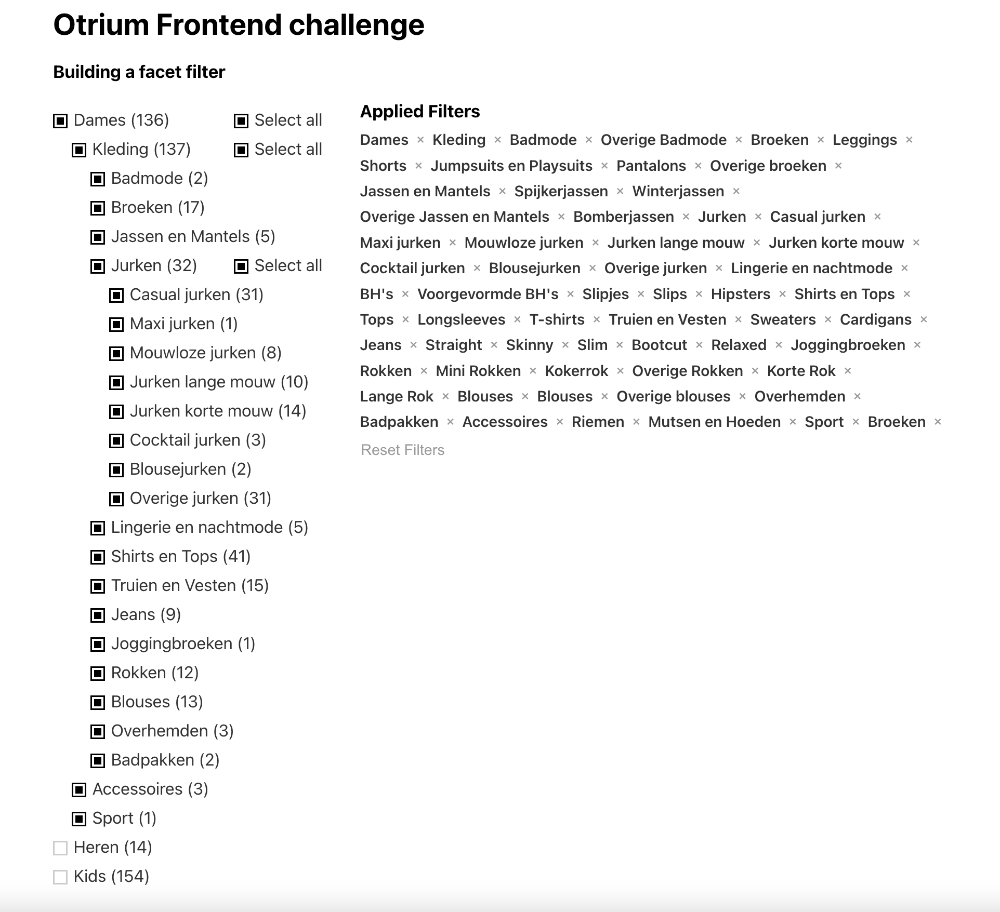

# Otrium Front-end Challenge

This project is a response to the front-end challenge by Otrium. It includes building a checkbox tree facet component using React. The component displays a tree of checkboxes that allow the user to filter products by categories, with the possibility to select individual or all sub-categories.

## Features

### 1. UI Tree of Checkboxes

The facet component showcases a tree-like structure of checkboxes, mirroring the categories provided by the server response. The primary categories form the root of the tree, with sub-categories branching out further.

### 2. Toggle to Show Children

Parent categories are initially the sole visible elements. Users can reveal child categories by clicking on a parent category, such as "Kleding."

### 3. Selected Category Functionality

Users can add selected categories to the applied filters, providing a clear and convenient overview of their chosen options.

### 4. Removing Selected Categories

The application supports the removal of individual or all selected categories simultaneously.

### 5. Select All Subtree

A "select all" checkbox is present within each child category, allowing the user to select all underlying categories within a specific subtree.

### 6. User Interface Design

The user interface features the Facet Filter on the left and the applied filters on the right. In more extensive applications, the applied filters could be modularized into a separate component, offering greater layout flexibility.

## How to Run

### `npm install`

Install the dependencies

### `npm start`

Runs the app in the development mode.\
Open [http://localhost:3000](http://localhost:3000) to view it in your browser.

The page will reload when you make changes.\
You may also see any lint errors in the console.

## How to Test

### `npm test`

Launches the test runner in the interactive watch mode.\
See the section about [running tests](https://facebook.github.io/create-react-app/docs/running-tests) for more information.

## Areas for Improvement

- **CSS**: The existing CSS provides basic styling but lacks structured handling.
- **Performance Optimization**: Performance can be improved, particularly when handling numerous categories.
- **Accessibility**: Performance can be improved, particularly when handling numerous categories.
- **State Management**: Integration with a state management library like Redux would enhance efficiency in managing selected categories within a larger application context.

## Screenshots

